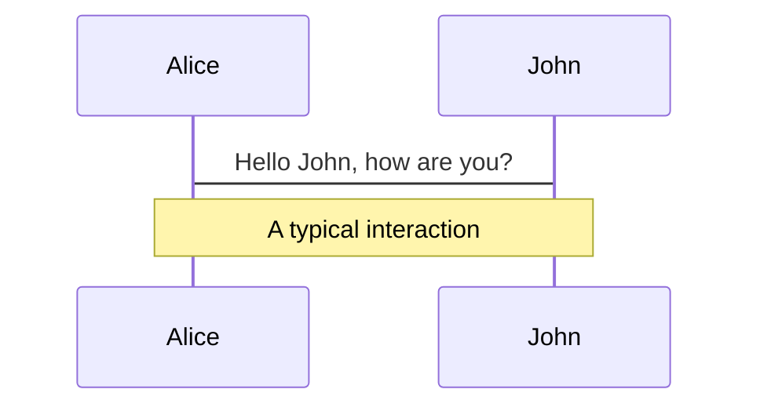
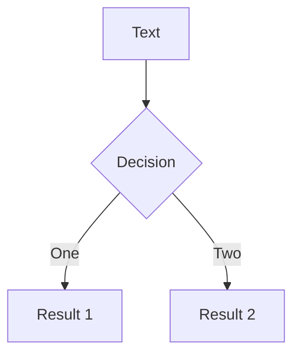

# Slidev Theme YX

Presentation slides for developers


---
class: tight
---

# What is Slidev?

<v-click>

Slidev is a slides maker and presenter designed for developers, consist of the following features

</v-click>

<v-clicks>

- 📝 **Text-based** - focus on the content with Markdown, and then style them later
- 🎨 **Themable** - theme can be shared and used with npm packages
- 🧑‍💻 **Developer Friendly** - code highlighting, live coding with autocompletion
- 🤹 **Interactive** - embedding Vue components to enhance your expressions
- 🎥 **Recording** - built-in recording and camera view
- 📤 **Portable** - export into PDF, PNGs, or even a hostable SPA
- 🛠 **Hackable** - anything possible on a webpage

</v-clicks>

<v-click>

Read more about [Why Slidev?](https://sli.dev/guide/why)

</v-click>

---

# Default Page

<v-clicks>

- This starts a **[topic]()**
- And we elaborate
- This leads to a conclusion

</v-clicks>

---

# Navigation

Hover on the bottom-left corner to see the navigation's controls panel

### Keyboard Shortcuts

|     |     |
| --- | --- |
| <kbd>space</kbd> / <kbd>tab</kbd> / <kbd>right</kbd> | next animation or slide |
| <kbd>left</kbd>  / <kbd>shift</kbd><kbd>space</kbd> | previous animation or slide |
| <kbd>up</kbd> | previous slide |
| <kbd>down</kbd> | next slide |

---
layout: image-right
image: 'https://source.unsplash.com/collection/94734566/1920x1080'
---

# Code

Use code snippets and get the highlighting directly!

```ts
interface User {
  id: number
  firstName: string
  lastName: string
  role: string
}

function updateUser(id: number, update: Partial<User>) {
  const user = getUser(id)
  const newUser = {...user, ...update}  
  saveUser(id, newUser)
}
```

---
layout: two-cols
---

# Diagram

<div>
<v-clicks>

- Look at the diagram
- Explain the diagram

</v-clicks>
</div>

<div>



</div>


---
layout: two-cols
---




---
layout: center
class: "text-center"
---

# Learn More

[Documentations](https://sli.dev) / [GitHub Repo](https://github.com/slidevjs/slidev)
